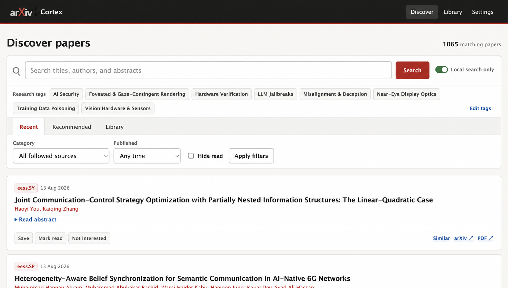

# Arxiv Cortex

Arxiv Cortex is a private, lightweight research radar for arXiv. It fetches metadata for followed keyword searches, optional subject fields, or both; indexes titles and abstracts locally; tracks saved/read/dismissed papers; finds exact semantic neighbors; and builds a personalized recommendation feed.



The application is deliberately small: Flask, server-rendered Jinja and HTMX, SQLite/FTS5, NumPy, and a local MiniLM embedding model. There is no hosted database, frontend build pipeline, Redis, Celery, or external vector service.

## Run locally

Requirements: [`uv`](https://docs.astral.sh/uv/) and Python 3.12 (uv can install Python automatically).

```bash
uv sync --extra dev
uv run arxiv-cortex
```

Open [http://127.0.0.1:5000](http://127.0.0.1:5000), follow one or more keyword searches and/or optional arXiv fields, and start the initial backfill. The first embedding run downloads `sentence-transformers/all-MiniLM-L6-v2` into the local Hugging Face cache.

Useful commands:

```bash
uv run flask --app arxiv_cortex init-db
uv run flask --app arxiv_cortex sync
uv run flask --app arxiv_cortex reindex
uv run pytest
uv run ruff check .
```

Normal tests never contact arXiv. Opt into the one-request contract check with
`ARXIV_CORTEX_RUN_LIVE=1 uv run pytest tests/test_live_arxiv.py`, or run the
100,000-vector benchmark with
`ARXIV_CORTEX_RUN_PERF=1 uv run pytest tests/test_performance.py`.

`arxiv-cortex` runs Waitress and enables the daily scheduler. `flask --app arxiv_cortex run` is suitable for development and intentionally does not enable scheduled jobs.

## Run with Docker

```bash
docker compose up --build
```

Compose binds only to `127.0.0.1`, stores the database in `./data`, and keeps model files in a named volume. Override the host port with `ARXIV_CORTEX_PORT`.
The lock selects PyTorch's CPU-only wheel on Linux, so the image does not carry CUDA runtimes.

## How it works

- SQLite stores canonical versionless arXiv IDs, normalized authors/categories, personal state, sync history, and float32 embedding BLOBs.
- FTS5 ranks title/author/abstract matches with weighted BM25.
- Editable research tags can be followed as first-class arXiv feed sources or kept as saved local searches. Plain words are combined with AND; comma-, semicolon-, or newline-separated groups match as exact phrases with OR between phrases. A field subscription is not required.
- A single polite arXiv client processes every followed keyword search and field sequentially and leaves at least 3.1 seconds between requests. Failed pages resume at their existing offset; transient 5xx responses use jittered exponential backoff, while 429 responses honor `Retry-After` or enter a longer cooldown visible in Settings.
- Initial feeds use a server-side `submittedDate` range to backfill 90 days. Daily updates sort by `lastUpdatedDate` and overlap the previous watermark by 48 hours so revisions are not missed.
- MiniLM embeds `title + abstract`. Normalized vectors are loaded into one contiguous NumPy matrix and ranked with exact dot products.
- Recommendations use the normalized mean of saved papers minus `0.35 ×` the mean of dismissed papers. Read papers are neutral but excluded from candidates.
- Browser mutations are CSRF-protected. The `/api/v1` API is read-only and has no CORS headers.

The generated OpenAPI contract is available at `/api/v1/openapi.json`.

## Data and privacy

V1 stores arXiv metadata and abstracts only. PDF links always point back to arXiv. The database, application secret, and synchronization history live in `data/`, which is ignored by Git.

Back up SQLite with its online backup command while the app is running:

```bash
mkdir -p backups
sqlite3 data/arxiv-cortex.sqlite3 ".backup 'backups/arxiv-cortex.sqlite3'"
```

If the `sqlite3` CLI is unavailable, stop the application before copying the database together with any `-wal` and `-shm` sidecar files. Keep `data/.flask-secret` with a private machine backup if preserving existing browser sessions matters.

This is a single-researcher, loopback-only application without accounts. Before exposing it beyond localhost, add authentication. When using Tailscale, expose it only through an HTTPS Tailscale proxy.

## Future work

The decision log, revision protocol, and implementation-ready v2 full-text/RAG handoff live in [docs/PLAN.md](docs/PLAN.md).
